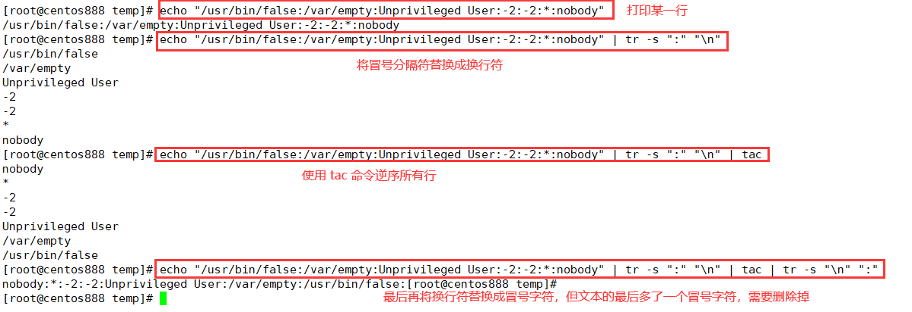

# script074
## 题目

将字段逆序输出文件 `nowcoder.txt` 的每一行，其中每一字段都是用英文冒号 `:` 相分隔。假设 `nowcoder.txt` 内容如下：
```text
nobody:*:-2:-2:Unprivileged User:/var/empty:/usr/bin/false
root:*:0:0:System Administrator:/var/root:/bin/sh
```

你的脚本应当输出：
```text
/usr/bin/false:/var/empty:Unprivileged User:-2:-2:*:nobody
/bin/sh:/var/root:System Administrator:0:0:*:root
```


## 脚本一

原理很简单，就是将每行文本按照冒号字符进行拆分，单独在一行，再利用 `tac` 命令逆序所有行，最后再将所有的行合并在一行通过冒号字符分隔，注意合并后的文本在末尾多一个冒号字符进行删除掉。



```shell
#!/bin/bash

# 读取文件的每一行
while read line; do 
  # 逆序文件行
  newline=$(echo "${line}" | tr -s ":" "\n" | tac | tr -s "\n" ":")
  # 删除行末尾的字符
  echo "${newline::-1}"
done < nowcoder.txt
```

> 注：该程序无法通过网站测试，可能是因为 `tac` 命令的影响。


## 脚本二

利用 `awk` 命令编程完成，实际上是每行按冒号分隔的字段域存储在一个数组中，然后倒序输出数组中的所有值拼接成新行，并通过冒号分隔。

```shell
awk -F ":" '{
  # 使用冒号作为分隔符，将每个字段域存储到数组中
  for(i=1;i<=NF;i++){
    arr[i]=$i
  }
  # 声明一个变量，存放逆转后的行文本
  msg=""
  # 注意，这里是逆序遍历数组中的所有元素
  for(j=NF;j>=1;j--){
    # 如果是第一次，则将数组元素直接赋给变量 msg
    if(msg==""){
      msg=arr[j]
    # 如果不是，则需要拼接文本，并使用冒号进行分隔  
    }else{
      msg=msg":"arr[j]
    }
  }
  # 最后打印拼接后的该行文本
  print msg
}' nowcoder.txt
```


## 脚本三

本质上是脚本二的变种，简化了代码。

```shell
awk -F ':' '{
	for (i = NF; i >= 2; i--) {
		printf("%s:", $i)
	}
	print($1)
}' nowcoder.txt
```