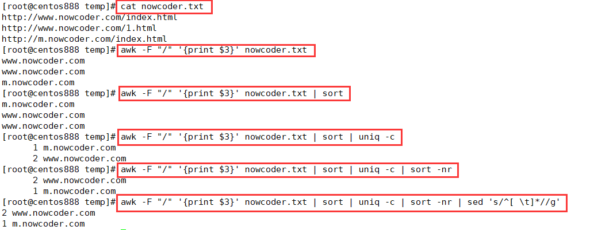

# script075
## 题目

> 注：题目来源于 [SHELL18 域名进行计数排序处理 ](https://www.nowcoder.com/practice/f076c0a3c1274cbe9d615e0f3fd965f1?tpId=195&tags=&title=&difficulty=0&judgeStatus=0&rp=1&sourceUrl=%2Fexam%2Foj%3Fpage%3D1%26tab%3DSHELL%25E7%25AF%2587%26topicId%3D195)。

假设我们有一些域名，存储在 `nowcoder.txt` 里，现在需要你写一个脚本，将域名取出并根据域名进行计数排序处理。

假设nowcoder.txt内容如下：
```text
http://www.nowcoder.com/index.html
http://www.nowcoder.com/1.html
http://m.nowcoder.com/index.html
```

你的脚本应该输出：
```text
2 www.nowcoder.com
1 m.nowcoder.com
```


## 脚本一

实际上就是提取网站地址的域名，首先使用 `awk` 命令取出第三列字段（通过 `/` 进行分隔），然后使用 `sort` 命令进行排序，再通过 `uniq -c` 命令去重并统计重复次数，再通过 `sort -nr` 按照重复次数倒序排序，最后通过 `sed` 命令去重每行开头的空格。



```shell
awk -F "/" '{print $3}' nowcoder.txt | sort | uniq -c | sort -nr | sed 's/^[ \t]*//g'
```


## 脚本二

使用 `awk` 命令编程，同样通过 `/` 字符进行分隔行，然后将第三个字段域存储到关联数组中，并记录它们的出现次数；最后在 `END{}` 中循环遍历关联数组中，输出键名和对应的键值。注意进行排序处理。

```shell
awk -F "/" '{
  for(i=1;i<=NF;i++){
    if(i==3){
      arr[$i]++
    }
  }
} END{
  for(k in arr){
    printf("%d %s\n", arr[k], k)
  }
}' nowcoder.txt | sort -r -k 1
```


## 脚本三

跟脚本二的原理一样，都是把字段存储到关联数组中，并对出现次数进行计数。只不过是通过 shell 脚本编程实现，而非 `awk` 编程实现。

```shell
#!/bin/bash

# 声明关联数组
declare -A arr 

# 循环读取文本行
while read line; do
  # 删除 // 前面的所有内容
  line=${line#*//}
  # 删除 / 后面的所有内容
  line=${line%%/*}
  # 存储到关联数组中并计数
  arr[$line]=$[ ${arr[$line]} + 1 ]
done < nowcoder.txt

# 为了能对结果排序，所以要进行处理
result=""
# 循环打印关联数组，对它们进行拼接
for k in ${!arr[@]}; do 
  # 如果是第一次则进行赋值
  if [ "${result}" == "" ]; then
    result="${arr[$k]} ${k}"
  # 如果不是第一次则需要对之前的内容进行拼接，通过换行符拼接  
  else
    result="${arr[$k]} ${k}""\n${result}" 
  fi
done

# 然后使用 sort 命令进行排序
echo -e "${result}" |  sort -r -k 1
```