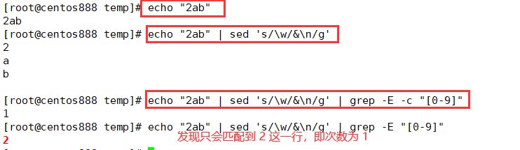

# script077
## 题目

假设我们有一个 `nowcoder.txt`，现在需要你写脚本，打印只有一个数字的行。假设 `nowcoder.txt` 内容如下
```text
haha
1
2ab
cd
77
```

那么你的脚本应该输出：
```text
1
2ab
```


## 脚本一

将每行的每个字符单独一行显示，然后使用 `grep -E` 命令检索只有数字的行，并统计出现次数，并且用 `if` 语句筛选出现次数为 1 的行。



```shell
#!/bin/bash

while read line; do
  num=$(echo -n ${line} | sed 's/\w/&\n/g' | grep -E -c "[0-9]")
  if [ ${num} -eq 1 ]; then
      echo ${line}
  fi
done < nowcoder.txt
```


## 脚本二

使用 `awk` 命令，通过正则表达式进行分隔。

```shell
awk -F "[0-9]" '{if(NF==2) print $0}' nowcoder.txt
```


## 脚本三

将每行的非数字使用 `sed` 命令替换为空，那么剩下的要么是空字符串，要么是数字字符串，然后统计行文本的字符个数，如果字符个数为 1 个则表示该行是只有一个数字的行。

```shell
#!/bin/bash

while read line; do
    out=$(echo ${line} | sed 's/[^0-9]//g')

    if [ ${#out} -eq 1 ]; then
        echo $line 
    fi
done < nowcoder.txt
```


## 脚本四

通过 `grep` 命令直接使用正则表达式进行匹配数字只出现一次的行。

```shell
grep -E '^[a-Z]*[0-9][a-Z]*$' nowcoder.txt
```


## 脚本五

通过 `awk` 命令直接使用正则表达式进行匹配数字只出现一次的行。

```shell
awk '/^[[:alpha:]]*[[:digit:]][[:alpha:]]*$/{print}' nowcoder.txt
```