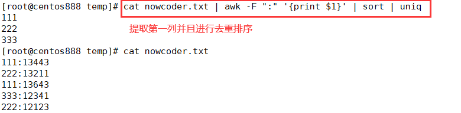
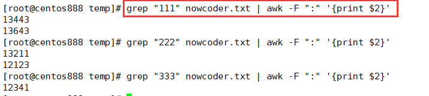

# script079
## 题目

> 注：题目来源于 [SHELL22 处理文本 ](https://www.nowcoder.com/practice/908d030e676a4fac997a127bfe63da64?tpId=195&tags=&title=&difficulty=0&judgeStatus=0&rp=1&sourceUrl=%2Fexam%2Foj%3Fpage%3D1%26tab%3DSHELL%25E7%25AF%2587%26topicId%3D195)。


假设我们有一个 `nowcoder.txt`，假设里面的内容如下：

```text
111:13443
222:13211
111:13643
333:12341
222:12123
```

现在需要你写一个脚本按照以下的格式输出：

```text
[111]
13443
13643
[222]
13211
12123
[333]
12341
```


## 脚本一

先获取到第一列的内容，并通过去重排序得到 `[ ]` 中的标题名，然后再通过这个标题名去文件中检索对应的行，然后提取第二列输出。





```shell
#!/bin/bash

result=$(cat nowcoder.txt | awk -F ":" '{print $1}' | sort | uniq)
for item in ${result} ; do
    echo "[${item}]"
    grep "${item}" nowcoder.txt | awk -F ":" '{print $2}'
done
```


## 脚本二

```shell
awk -F ":" '{
	# 存储到关联数组中，键名是 `111`、`222`、`333`；键值是拼接的字符串，即 "13211 \n 12123"
	# 这里的三元表达式是为了拼接多行字符串，中间通过换行符分隔
    res[$1] = (res[$1] == "" ? $2 : (res[$1] "\n" $2))
}END{
	# 最后循环打印关联数组
    for(k in res){
    	# 输出键名
        print "["k"]"
        # 输出键名对应的键值
        print res[k]
    }
}' nowcoder.txt
```